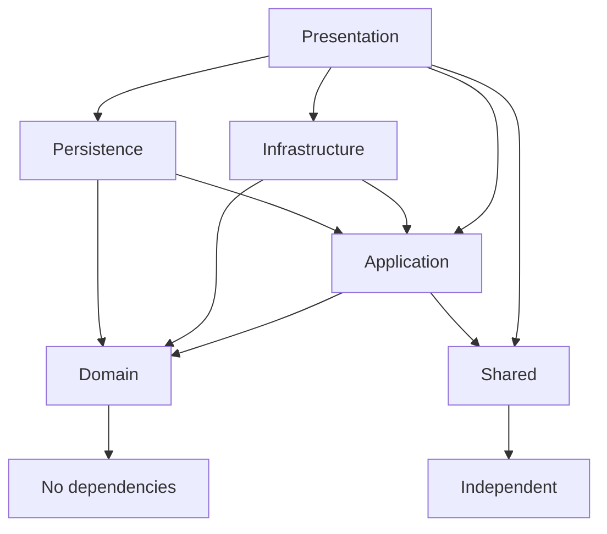

# Enterprise ASP.NET Core MVC 8 Architecture

## 1. Solution and Folder Structure

The solution is intentionally split into `Presentation`, `Application`, `Domain`, `Infrastructure`, `Persistence`, and `Shared` projects. `Domain` has no project references, `Shared` is independent, `Application` references `Domain` and `Shared`, `Infrastructure` and `Persistence` reference `Application` and `Domain`, and `Presentation` composes all layers at runtime.

**Reason for selection:** this is Clean Architecture with a dependency rule that points inward toward business policy.

**Advantages:** independent domain model, testable use cases, replaceable infrastructure, and maintainable team boundaries.

**Disadvantages:** more projects and more ceremony than a small CRUD application.

**Best practice:** keep controllers thin, keep persistence concerns out of domain entities, and register dependencies only through extension methods.

```text
EnterpriseTemplate.sln
src/
  EnterpriseTemplate.Presentation
  EnterpriseTemplate.Application
  EnterpriseTemplate.Domain
  EnterpriseTemplate.Infrastructure
  EnterpriseTemplate.Persistence
  EnterpriseTemplate.Shared
```

## 2. Dependency Diagram



## 3. Database Architecture

The persistence layer uses EF Core 8 with SQL Server, `ApplicationDbContext`, `IEntityTypeConfiguration`, audit fields, soft delete, and global query filters. ASP.NET Core Identity tables are hosted in the same context, while domain users remain separate aggregate roots linked by `IdentityApplicationUser.DomainUserId`.

**Reason for selection:** Identity can evolve independently from the domain user aggregate, which prevents framework concerns from polluting domain rules.

**Advantages:** schema consistency, centralized transactions, soft-delete safety, and clear Identity/domain separation.

**Disadvantages:** extra mapping is required between Identity records and domain users.

**Migration strategy:** create migrations in `EnterpriseTemplate.Persistence`, apply them through CI/CD, and never run destructive migrations automatically in production.

## 4. Authentication Architecture

Authentication is hybrid and uses a provider pattern: `IAuthenticationProvider`, `IdentityAuthenticationProvider`, `ActiveDirectoryAuthenticationProvider`, and `EntraAuthenticationProvider`. The active provider is selected through `AuthenticationProviderOptions.ActiveProvider`.

**Reason for selection:** enterprise environments often need phased migration from Windows/AD to Entra ID while still supporting local Identity users.

**Advantages:** replaceable providers, environment-specific configuration, testability, and reduced controller coupling.

**Disadvantages:** provider orchestration adds runtime configuration responsibility.

## 5. Authorization Architecture

Authorization is permission-based. ASP.NET Core Identity roles are retained only as authentication-layer permission containers through `AspNetRoles` and `AspNetUserRoles`; duplicate domain roles and domain user-role membership are intentionally avoided. Dynamic policies use permission codes such as `users.create` and are resolved by `DynamicAuthorizationPolicyProvider`; `PermissionHandler` delegates checks to `IPermissionService`, which resolves `AspNetUserRoles` -> `Domain.RolePermissions` -> `Domain.Permissions`.

**Reason for selection:** Identity remains responsible for authentication and role membership, while domain permissions provide fine-grained enterprise governance without polluting the domain with ASP.NET Core framework types.

**Advantages:** one user-role membership source, no duplicate role management, dynamic permission policies avoid hardcoding every policy, permissions can be seeded and changed in the database, and controllers remain declarative.

**Disadvantages:** permission lookup needs caching and invalidation in high-scale environments, and role administration must treat Identity roles as permission containers rather than business aggregates.

## 6. Domain Design

The domain layer contains `BaseEntity`, `AuditableEntity`, `AggregateRoot`, value objects (`Email`, `MobileNumber`, `FullName`), enums, domain events, and aggregate roots. Business invariants such as valid email, full name, activation, and deactivation are enforced in domain classes.

**Reason for selection:** DDD Lite keeps business rules close to the model without overengineering bounded contexts for an initial enterprise template.

**Advantages:** expressive model, centralized invariants, and future support for domain-event dispatch.

**Disadvantages:** more explicit construction and EF Core configuration are needed for value objects.

## 7. Application Layer Design

The application layer defines DTOs, services, exceptions, validators, AutoMapper profiles, CQRS abstractions, and MediatR pipeline behaviors for validation, logging, and transactions.

**Reason for selection:** use cases are isolated from MVC and EF Core details.

**Advantages:** highly testable services, consistent validation, consistent exception contracts, and a clean path to CQRS.

**Disadvantages:** simple operations require DTOs and mappings.

## 8. Repository and Unit of Work

`IGenericRepository<TEntity>` abstracts basic data access and `IUnitOfWork` coordinates commits and transactions. The EF Core implementation uses `AsNoTracking` for read-only list queries and async APIs with cancellation tokens.

**Reason for selection:** repositories provide test seams and prevent application services from depending directly on EF Core.

**Advantages:** simpler mocking, encapsulated persistence, and transaction consistency.

**Disadvantages:** generic repositories can be too broad; add aggregate-specific repositories for complex queries.

## 9. Infrastructure Layer

Infrastructure contains provider-agnostic logging (`IApplicationLogger` adapter), cache services (`MemoryCacheService`, `DistributedCacheService`), external service contracts, and a background service.

**Reason for selection:** infrastructure is replaceable and does not leak concrete vendor dependencies into the domain or application layers.

**Advantages:** Serilog, NLog, Seq, ELK, OpenTelemetry, Datadog, Splunk, or Application Insights can be introduced later without changing business code.

**Disadvantages:** adapters must be implemented for each provider.

## 10. Presentation Layer

The MVC layer contains areas (`Admin`, `Identity`, `Management`, `Reports`, `Settings`), thin controllers, view models, filters, Razor views, layouts, and middleware. Controllers only receive requests, call services, and return responses.

**Reason for selection:** presentation remains focused on HTTP/MVC concerns while application services own workflows.

**Advantages:** easier UI refactoring, better testability, and clean separation from business logic.

**Disadvantages:** view models add mapping work.

## 11. Exception Handling

`GlobalExceptionMiddleware` converts application exceptions to RFC 7807 `ProblemDetails` responses and includes a correlation ID. `CorrelationIdMiddleware` ensures traceability across logs and responses.

**Reason for selection:** consistent error contracts improve diagnostics and client integration.

**Advantages:** structured errors, auditable correlation, and no duplicated controller try/catch blocks.

**Disadvantages:** exception taxonomy must be maintained as the system grows.

## 12. Configuration

Options classes include `JwtOptions`, `DatabaseOptions`, `CacheOptions`, `AuthenticationProviderOptions`, `EmailOptions`, and `ActiveDirectoryOptions`.

**Reason for selection:** Options Pattern enables validation, environment overrides, and strong typing.

**Advantages:** safer configuration, easier testing, and clean startup code.

**Disadvantages:** more classes and binding setup.

## 13. Security

The template enables anti-forgery, secure cookies, HSTS, CSP, X-Frame-Options, X-Content-Type-Options, XSS header compatibility, strong Identity password policy, account lockout, security stamp validation, Data Protection, and rate limiting.

**Reason for selection:** security must be part of the baseline rather than a later add-on.

**Advantages:** reduced OWASP risk and consistent production posture.

**Disadvantages:** CSP and SameSite settings may need tuning for third-party integrations.

## 14. Performance

The template uses async APIs, cancellation tokens, response caching, output caching, pagination, `AsNoTracking`, and projection-ready DTO mappings.

**Reason for selection:** scalable MVC applications must avoid blocking I/O and unbounded queries.

**Advantages:** better throughput and predictable database load.

**Disadvantages:** caching requires invalidation rules and observability.

## 15. Sample CRUD Module

The user module demonstrates a production-ready vertical slice: MVC controller, view models, DTOs, FluentValidation validators, AutoMapper profile, domain aggregate, generic repository, unit of work, EF Core configuration, and Razor views.

## 16. Future Scalability Recommendations

- Add aggregate-specific repositories for complex optimized queries.
- Add Redis for distributed cache in multi-node deployments.
- Add domain-event dispatch after `SaveChangesAsync`.
- Add OpenTelemetry through the logging abstraction and native ASP.NET Core instrumentation.
- Add permission-result caching with invalidation on role-permission changes.
- Add API endpoints and JWT only when external clients need them.
- Split modules into bounded contexts if the domain grows beyond DDD Lite.
