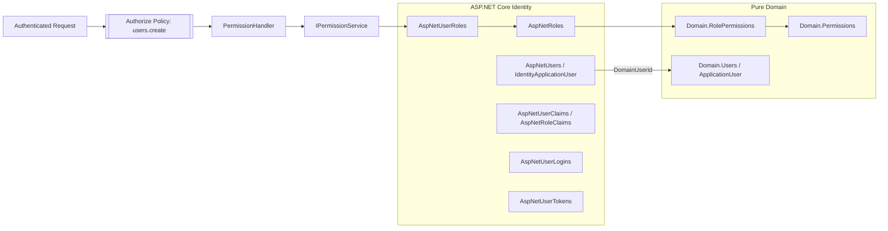

# Authentication and Authorization Refactoring

## Architectural analysis

The previous model mixed authentication concerns and business authorization concepts across two role systems:

- ASP.NET Core Identity already provided authentication users, roles, user-role membership, claims, password hashes, security stamps, lockout, external logins, and tokens.
- The domain layer also contained `Role` and `UserRole` entities, duplicating `AspNetRoles` and `AspNetUserRoles`.
- Permission resolution had an application-layer stub that always returned `false`, so dynamic permission policies could not authorize users correctly.

The refactored architecture keeps each layer focused:

- **Domain** owns business user state and permission definitions only. It does not reference ASP.NET Core Identity, ASP.NET Core Authorization, `HttpContext`, `ClaimsPrincipal`, or authentication framework types.
- **Identity** owns authentication and role membership.
- **Permissions** remain domain concepts because they describe business capabilities.
- **Role permissions** connect a domain permission to an Identity role by storing the Identity role id as a scalar `Guid`. This avoids a domain dependency on `IdentityRole` while preserving referential integrity in persistence configuration.
- **Authorization policies** are permission-based: controllers request permission codes such as `users.create`, and the authorization handler checks whether the authenticated Identity user belongs to a role that has that permission.

## Updated architecture diagram

## Step-by-step migration plan

1. Remove the domain `Role` aggregate and domain `UserRole` join entity.
2. Remove EF Core mappings for `Domain.Roles` and `Domain.UserRoles`.
3. Keep `ApplicationUser` as the business aggregate root and remove role membership navigation from it.
4. Keep `Permission` as the domain permission definition.
5. Refactor `RolePermission` so `RoleId` points to an ASP.NET Core Identity role id while the domain entity stores only scalar identifiers and a `Permission` navigation.
6. Configure the `RolePermission` to `IdentityRole<Guid>` relationship in the persistence layer, not in the domain layer.
7. Replace the stub permission resolver with an EF Core resolver that joins `AspNetUserRoles` -> `Domain.RolePermissions` -> `Domain.Permissions`.
8. Update dynamic authorization policies to accept permission code policy names directly, for example `[Authorize(Policy = "users.create")]`.
9. Replace role-based controller authorization with permission-based authorization.
10. Update seed data so permissions are lower-case policy codes and the Identity `Administrator` role is the permission container.
11. Update the manual SQL migration so `Domain.Roles` and `Domain.UserRoles` are not created and legacy rows are migrated to Identity tables when present.

## Entity changes

- Removed `EnterpriseTemplate.Domain.Authorization.Role`.
- Removed `EnterpriseTemplate.Domain.Users.UserRole`.
- Updated `EnterpriseTemplate.Domain.Users.ApplicationUser` so it contains only business user state and behavior.
- Updated `EnterpriseTemplate.Domain.Authorization.RolePermission` so it represents permission grants for Identity roles without referencing Identity framework types.

## DbContext and persistence changes

- Removed `DomainRoles` from `ApplicationDbContext`.
- Added `RolePermissions` to `ApplicationDbContext` for explicit permission-grant queries.
- Removed `RoleConfiguration` and `UserRoleConfiguration`.
- Updated `RolePermissionConfiguration` to map `RoleId` to `AspNetRoles.Id` through `IdentityRole<Guid>` in persistence.
- Added a persistence-layer `PermissionService` implementation that resolves permissions using Identity user-role membership.

## Migration changes

- `Domain.Roles` is no longer created.
- `Domain.UserRoles` is no longer created.
- `Domain.RolePermissions.RoleId` now references `AspNetRoles.Id`.
- Existing legacy `Domain.Roles` rows are migrated into `AspNetRoles` when the manual script is run against a database that has the old duplicate schema.
- Existing legacy `Domain.UserRoles` rows are migrated into `AspNetUserRoles` when they can be mapped through `AspNetUsers.DomainUserId`.
- Manual migration history includes a second baseline marker for the duplicate-role removal.

## Code modifications by file

- `src/EnterpriseTemplate.Domain/Users/ApplicationUser.cs`: removed domain role membership state from the business user aggregate.
- `src/EnterpriseTemplate.Domain/Authorization/RolePermission.cs`: changed the role side to an Identity role id scalar and kept the permission navigation.
- `src/EnterpriseTemplate.Persistence/ApplicationDbContext.cs`: removed `DomainRoles` and exposed `RolePermissions`.
- `src/EnterpriseTemplate.Persistence/Configurations/ApplicationUserConfiguration.cs`: removed `UserRoles` navigation configuration.
- `src/EnterpriseTemplate.Persistence/Configurations/RolePermissionConfiguration.cs`: mapped `RolePermission.RoleId` to `IdentityRole<Guid>`.
- `src/EnterpriseTemplate.Persistence/Seed/SeedData.cs`: seeds permissions, the Identity Administrator role, and role-permission grants.
- `src/EnterpriseTemplate.Application/Services/IPermissionService.cs`: renamed the contract to `HasPermissionAsync` and clarified that the input user id is the authenticated Identity user id.
- `src/EnterpriseTemplate.Persistence/Authorization/PermissionService.cs`: added the EF Core permission resolver.
- `src/EnterpriseTemplate.Application/DependencyInjection.cs`: removed the old application-layer stub permission service registration.
- `src/EnterpriseTemplate.Persistence/DependencyInjection.cs`: registers the persistence permission resolver.
- `src/EnterpriseTemplate.Presentation/Authorization/DynamicAuthorizationPolicyProvider.cs`: builds permission policies from direct permission code names while retaining legacy `Permission:` prefix support.
- `src/EnterpriseTemplate.Presentation/Authorization/PermissionHandler.cs`: calls `HasPermissionAsync`.
- `src/EnterpriseTemplate.Shared/Constants/PolicyNames.cs`: adds canonical permission policy constants.
- `src/EnterpriseTemplate.Presentation/Controllers/UserController.cs`: uses permission policies directly.
- `src/EnterpriseTemplate.Presentation/Controllers/RoleController.cs`: replaces role-based authorization with permission-based authorization.
- `src/EnterpriseTemplate.Presentation/Controllers/PermissionController.cs`: replaces role-based authorization with permission-based authorization.
- `TestAdmin_Manual_Migration.sql`: updates the manual SQL schema and legacy role migration steps.
- `TestAdmin_Manual_Migration_README.md`: documents the refactored schema and execution order.
