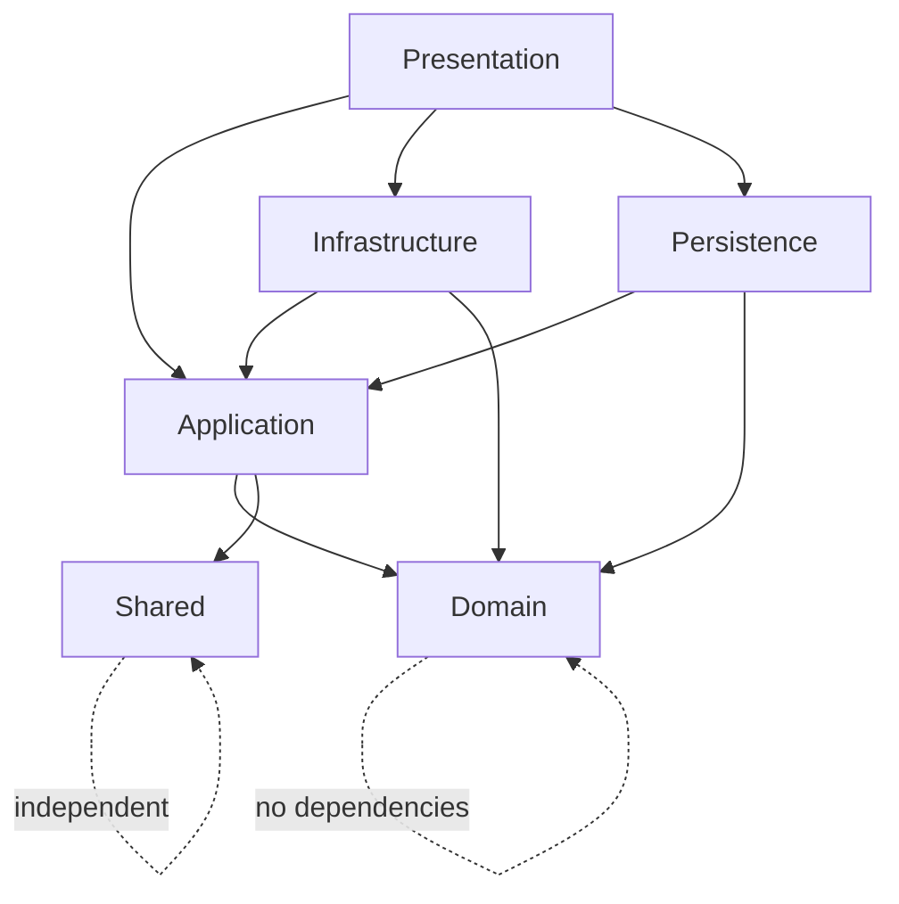
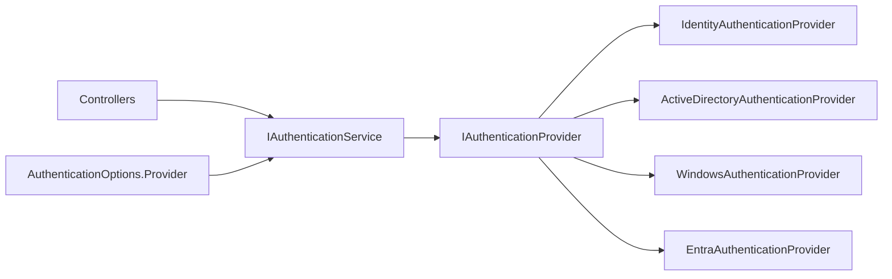

# Enterprise ASP.NET Core MVC Architecture

> Target stack verified for 2026: .NET 10 LTS and EF Core 10 are selected because Microsoft lists .NET 10 as LTS supported until November 2028 and EF Core 10.0 as targeting .NET 10 with support until November 10, 2028.

## 1. Solution Structure

```text
ProjectName.sln
src/
  ProjectName.Presentation      # ASP.NET Core MVC, Razor, filters, middleware, security
  ProjectName.Application       # Use cases, DTOs, validation, mapping, CQRS behaviors, contracts
  ProjectName.Domain            # Entities, value objects, enums, events, business rules
  ProjectName.Infrastructure    # Repository/UoW, cache, logging adapter, auth provider strategies
  ProjectName.Persistence       # DbContext, Identity, EF configurations, seed/migration strategy
  ProjectName.Shared            # Cross-cutting constants and options models
tests/
  ProjectName.UnitTests
  ProjectName.IntegrationTests
  ProjectName.ArchitectureTests
```

## 2. Dependency Diagram



## 3. Database Architecture

- SQL Server is configured by `DatabaseOptions` and EF Core `ApplicationDbContext`.
- Domain aggregates are stored under `app` and `auth` schemas.
- ASP.NET Core Identity tables are isolated in Persistence through `ApplicationIdentityUser`.
- Auditing fields are applied in `SaveChangesAsync`.
- Soft delete converts deletes into updates and global query filters hide deleted records.
- Migration strategy: create deterministic EF Core migrations in `ProjectName.Persistence`; run migrations in deployment pipelines; seed roles, permissions, and admin user using idempotent seed routines.

## 4. Entity Design

- `BaseEntity`: identity and domain event collection.
- `AuditableEntity`: enterprise audit and soft-delete state.
- `AggregateRoot`: repository boundary marker.
- `ApplicationUser`: user aggregate with profile, status, roles, and activation/deactivation events.
- `Role`, `Permission`, `RolePermission`, `UserRole`: business authorization model independent of Identity internals.
- Value objects: `Email`, `MobileNumber`, `FullName` protect invariants inside Domain.

## 5. Authentication Architecture



Provider selection is configuration-driven. Identity, Active Directory/LDAP, Windows Authentication, and Microsoft Entra ID implementations can evolve independently behind `IAuthenticationProvider`.

## 6. Authorization Architecture

- Role-based authorization uses ASP.NET Core role policies.
- Policy-based authorization uses named policies.
- Permission-based authorization uses dynamic policies with names like `Permission:Users.Read`.
- `DynamicAuthorizationPolicyProvider` creates policies at runtime.
- `PermissionHandler` delegates lookups to `IPermissionService`, allowing cached, database, claims, or external PDP implementations.

## 7. Repository and Unit of Work

- `IGenericRepository<TEntity>` and `IUnitOfWork` live in Application as ports.
- `GenericRepository<TEntity>` and `UnitOfWork` live in Infrastructure as adapters.
- Use cases depend on abstractions; EF Core details remain outside business code.

## 8. Presentation Architecture

Areas: Admin, Identity, Management, Reports, Settings.
Controllers: BaseController, DashboardController, UserController, RoleController, PermissionController.
Filters: GlobalExceptionFilter, AuditActionFilter, ValidationFilter.
Middleware: CorrelationId, SecurityHeaders, ExceptionHandling.
Razor: Views, Shared layout, validation partials, area views.

## 9. Security

- CSRF: AutoValidateAntiforgeryToken and explicit ValidateAntiForgeryToken.
- XSS/CSP: strict security headers middleware.
- Secure cookies: `__Host-` cookie, HttpOnly, Secure, SameSite Strict.
- Password policy and lockout: configured in Identity options.
- Data Protection: registered in Presentation.
- Rate limiting: global fixed-window limiter.
- Correlation id and RFC7807 ProblemDetails for incident traceability.

## 10. Performance

- Async methods and `CancellationToken` throughout use cases/controllers.
- Pagination with page/pageSize and bounded maximum page size.
- Query projection to DTOs with `AsNoTracking`.
- Response caching and output caching middleware registered.
- Cache abstraction supports memory or distributed providers.

## 11. Best Practices and Future Scalability

- Add OpenTelemetry adapter for `IApplicationLogger` and distributed traces when observability requirements mature.
- Move permission lookups from cache placeholder to database + cache-aside strategy.
- Add outbox pattern for reliable domain event dispatch.
- Add API controllers under versioned routes when public APIs are required.
- Add Key Vault/user-secrets for JWT keys and connection strings.
- Use read replicas and CQRS read models for high-volume reporting.
- Replace in-process background queue with a durable scheduler for critical jobs.
